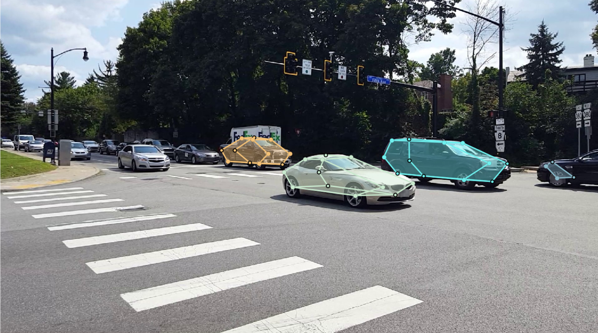
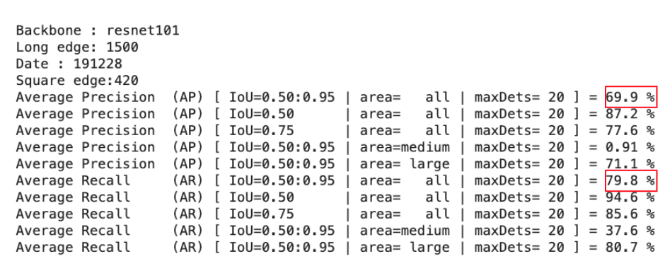
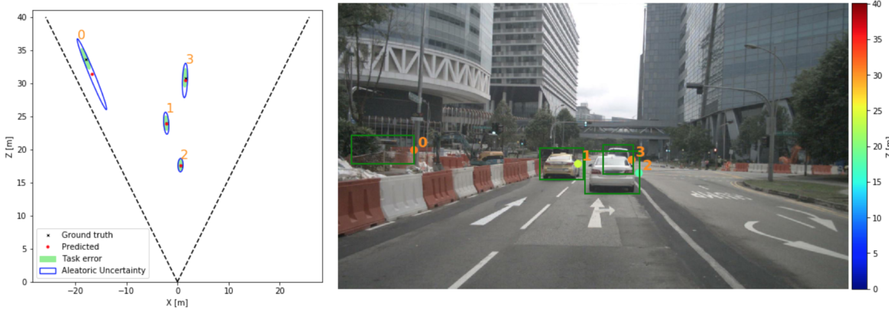
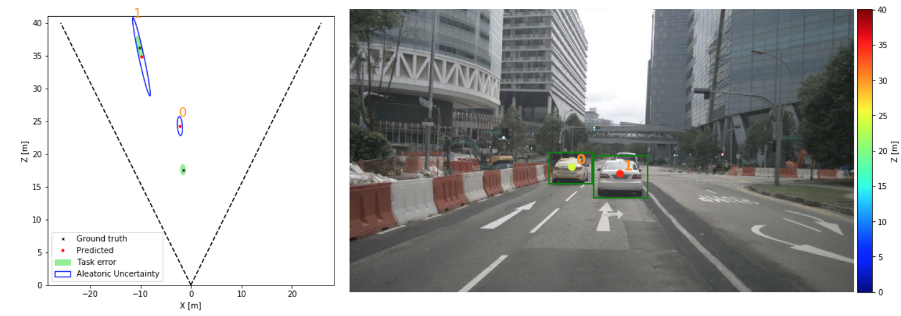

# Semester Project : Keypoint-based vehicle 3D localization

This github repository is the result of a semester project performed in the [VITA laboratory](https://www.epfl.ch/labs/vita/) at the EPFL during the second semester of 2019. The goal of this semester was to implement a keypoint based vehicle detection and ditance estimation. To do so, 2 previous work performed by the laboratory were used: the [Openpifpaf algorithm](https://github.com/vita-epfl/openpifpaf) for the keypoint detection and the [Monoloco algorithm](https://github.com/vita-epfl/monoloco) for the distance estimation.

This github is divised into several folders with instructions inside each of those folders for the installation and to know how to use each subpart of the project.

Pretrained model are available in the release section of this [github](https://github.com/peterbonnesoeur/keypoint-based-car-detector/releases)

# Introduction 

Here will be presented each folder of this github in the chronological order. We will see how to generate the dataset with [Carfusion](http://www.cs.cmu.edu/~mvo/index_files/Papers/CarFusion.pdf). Then, we will handle the training and evaluation of the openpifpaf model. Finally, the training and evaluation of Monoloco with the bounding box of the [Nuscenes dataset](https://www.nuscenes.org/) at first then with the model created by openpifpaf will be treated.

# 1 -  Carfusion_to_coco

The coco dataset will be downloaded and processed at first. The folder 'carfusion_to_coco' have a script to download the carfusion dataser. It countains the position of the keypoints of the cars as depicted in the image below:

It is necessary to process this dataset to indicate the position of the non annotated cars:

# 2 - Openpifpaf

This part is about training and evaluating the keypoints based vehicle detection through the openpifpaf algorithm. It should take as an input an RGB image and output a set of keypoints which delimit the car:

# 3- Benchmarking Pifpaf

This folder countains a notebooks that will only do a quick resume of the different benchmarking that you have done with openpifpaf. It is usefull to select which model is the most adequate for a peculiar application.

# 4 - Bounding box of Nuscenes preporcessing

This part is not obligatory. It countains a method to preprocess the bounding box of the nuscenes. The objective was to see if Monoloco was able to predict the position of the vehicle based on their bounding box. 

If you are not looking to prove this, you can forget this part and go straight to the training of monoloco with the openpifpaf's keypoints.

# 5 - Monoloco training and evaluation

This folder countains the modified version of Monoloco to perform the training and evaluation on the pifpaf keypoints and or the nuscenes boxes. This algorithm takes as input a set of keypoints and the intrinsic matrix K of the camera and outputs the estimated distance with an aleatoric uncertainty.

This part is still in development.

