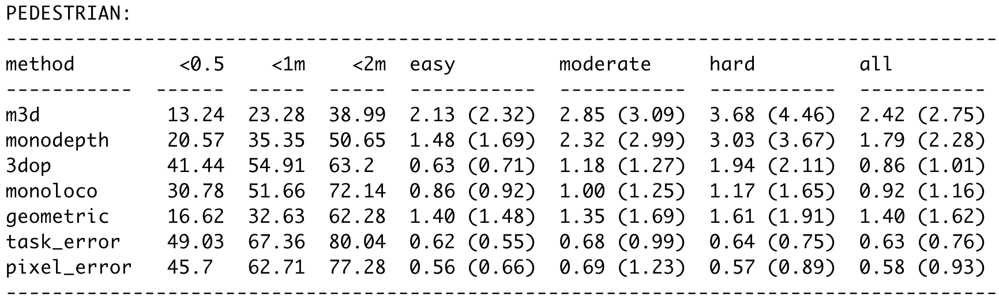

# Monoloco - Detection of cars

> We tackle the fundamentally ill-posed problem of 3D human localization from monocular RGB images. Driven by the limitation of neural networks outputting point estimates, we address the ambiguity in the task by predicting confidence intervals through a loss function based on the Laplace distribution. Our architecture is a light-weight feed-forward neural network that predicts 3D locations and corresponding confidence intervals given 2D human poses. The design is particularly well suited for small training data, cross-dataset generalization, and real-time applications. Our experiments show that we (i) outperform state-of-the-art results on KITTI and nuScenes datasets, (ii) even outperform a stereo-based method for far-away pedestrians, and (iii) estimate meaningful confidence intervals. We further share insights on our model of uncertainty in cases of limited observations and out-of-distribution samples.
# Introduction:

This work is a modification of the original [Monoloco](https://github.com/vita-epfl/monoloco) algorithm to be able to estimate the position of cars thanks to the data from the keypoints obtained with Openpifpaf.

In order to make this version work, a few modification needs to be performed in the following files:

**BEFORE ANYTHING ELSE**
## In network/process.py

In the function 'prepare_pif_kps', an if statement at the line 143 will decide wether or not we truncaturate the keypoints [8,9] of the detectected keypoints. Those 2 keypoints arecorresponding to the mirrors of the cars. Given that the carfusion dataset rarely annotate the mirrors, the uncertainty produced when we use the command '--force-complete-pose' when we predict the skeleton of the car is high. Hence, we obtain better results by removing those 2 keypoints from our data.

- *If* you decide to let the value of the IF statement to 'True', your number of keypoints should be (nb_keypoints - 2) [In our case: 12]

- *If* you decide to put the value of the IF statement to 'False', your number of keypoints should be (nb_keypoints ) [In our case: 14]

## In network/net.py
Ensure that the 'INPUT_SIZE'(line 20) is your number of keypoints multiplied by 2.  

## In train/trainer.py
Ensure that the 'n_joints'(line 12) is equal to your number of keypoints

## In network/pifpaf.py
Replace the 'args.checkpoint'(line 45) by your trained openpifpaf model (you can ignore this step if you are giving your model as an argument with the command --checkpoint)

## in prep/transform.py 
Replace 'COCO_KEYPOINT' and 'HFLIP' with the 'COCO_KEYPOINT' and 'HFLIP' that you used to train your model.

## in prep/preprocess_nu.py
If you did not genrate the json files of the nuscenes dataset with openpifpaf, you can nonetheless run preprocess_nu.py which will process the keypoints by himself (not recommended because slower). 
You need to modify the checkpoint of 'openpifpaf.network.factory'(line 73) with your trained openpifpaf model.

## in prep/preprocess_ki.py
If you did not genrate the json files of the kitti dataset with openpifpaf, you can nonetheless run preprocess_ki.py which will process the keypoints by himself (not recommended because slower). 
You need to modify the checkpoint of 'openpifpaf.network.factory'(line 71) with your trained openpifpaf model.

## in eval/generate_kitti.py
Ensure that the variable in 'CATEGORIES'(line 31) is equal to the name of the category that you want to evaluate (in our case, 'car')

## in eval/eval_kitti.py
Ensure that the variable in 'CATEGORIES'(line 31) is equal to the name of the category that you want to evaluate (in our case, 'car')

**END OF THE MODIFICATIONS**

The rest of the functionnalities and the method to use Monoloco still remains the exact same. The rest of the documentation should provide you all of the necessary informations needed to work with Monoloco.

```
@article{bertoni2019monoloco,
  title={MonoLoco: Monocular 3D Pedestrian Localization and Uncertainty Estimation},
  author={Bertoni, Lorenzo and Kreiss, Sven and Alahi, Alexandre},
  journal={arXiv preprint arXiv:1906.06059},
  year={2019}
}
```
* **Paper on [ArXiv](https://arxiv.org/abs/1906.06059)**
* **Check our video with method description and qualitative results on [YouTube](https://www.youtube.com/watch?v=ii0fqerQrec)**

* **Live demo available! (more info in the webcam section)**


# Setup

### Install
Python 3 is required. Python 2 is not supported. 
Do not clone this repository and make sure there is no folder named monoloco in your current directory.

```
pip3 install monoloco
```

For development of the monoloco source code itself, you need to clone this repository and then:
```
pip3 install -e '.[test, prep]'
```
Python 3.6 or 3.7 is required for nuScenes development kit. 
All details for Pifpaf pose detector at [openpifpaf](https://github.com/vita-epfl/openpifpaf).


### Data structure

    Data         
    ├── arrays                 
    ├── models
    ├── kitti
    ├── nuscenes
    ├── logs
    

Run the following to create the folders:
```
mkdir data
cd data
mkdir arrays models kitti nuscenes logs
```

### Pre-trained Models
* Download a MonoLoco pre-trained model from 
[Github](https://github.com/peterbonnesoeur/keypoint-based-car-detector/releases) and save it in `data/models` 
(default) or in any folder and call it through the command line option `--model <model path>`
* Pifpaf pre-trained model need to be downloaded from [Github](https://github.com/peterbonnesoeur/keypoint-based-car-detector/releases) as well or can be genrated with the training of openpifpaf.


# Interfaces
All the commands are run through a main file called `main.py` using subparsers.
To check all the commands for the parser and the subparsers (including openpifpaf ones) run:

* `python3 -m monoloco.run --help`
* `python3 -m monoloco.run predict --help`
* `python3 -m monoloco.run train --help`
* `python3 -m monoloco.run eval --help`
* `python3 -m monoloco.run prep --help`

or check the file `monoloco/run.py`
              
# Prediction
The predict script receives an image (or an entire folder using glob expressions), 
calls PifPaf for 2d human pose detection over the image
and runs Monoloco for 3d location of the detected poses.
The command `--networks` defines if saving pifpaf outputs, MonoLoco outputs or both.
You can check all commands for Pifpaf at [openpifpaf](https://github.com/vita-epfl/openpifpaf).


Output options include json files and/or visualization of the predictions on the image in *frontal mode*, 
*birds-eye-view mode* or *combined mode* and can be specified with `--output_types`


### Ground truth matching
* In case you provide a ground-truth json file to compare the predictions of MonoLoco,
 the script will match every detection using Intersection over Union metric. 
 The ground truth file can be generated using the subparser `prep` and called with the command `--path_gt`.
 Check preprocess section for more details or download the file from 
 [here](https://drive.google.com/open?id=1F7UG1HPXGlDD_qL-AN5cv2Eg-mhdQkwv).

* In case you don't provide a ground-truth file, the script will look for a predefined path.
If it does not find the file, it will generate images
with all the predictions without ground-truth matching.

Below an example with and without ground-truth matching. They have been created (adding or removing `--path_gt`) with:
`python3 -m monoloco.run predict --glob docs/002282.png --output_types combined --scale 2 
--model data/models/monoloco-190513-1437.pkl --n_dropout 50 --z_max 30`
 
With ground truth matching (only matching people):


Without ground_truth matching (all the detected people): 


### Images without calibration matrix
To accurately estimate distance, the focal length is necessary. 
However, it is still possible to test Monoloco on images where the calibration matrix is not available. 
Absolute distances are not meaningful but relative distance still are. 
Below an example on a generic image from the web, created with:
`python3 -m monoloco.run predict --glob docs/surf.jpg --output_types combined --model data/models/monoloco-190513-1437.pkl --n_dropout 50 --z_max 25`


# Preprocessing

### Datasets

#### 1) KITTI dataset
Download KITTI ground truth files and camera calibration matrices for training
from [here](http://www.cvlibs.net/datasets/kitti/eval_object.php?obj_benchmark=3d) and
save them respectively into `data/kitti/gt` and `data/kitti/calib`. 
To extract pifpaf joints, you also need to download training images soft link the folder in `
data/kitti/images`

#### 2) nuScenes dataset
Download nuScenes dataset from [nuScenes](https://www.nuscenes.org/download) (either Mini or TrainVal), 
save it anywhere and soft link it in `data/nuscenes`

nuScenes preprocessing requires `pip3 install nuscenes-devkit`


### Annotations to preprocess
MonoLoco is trained using 2D human pose joints. To create them run pifaf over KITTI or nuScenes training images. 
You can create them running the predict script and using `--networks pifpaf`.

### Inputs joints for training
MonoLoco is trained using 2D human pose joints matched with the ground truth location provided by
nuScenes or KITTI Dataset. To create the joints run: `python3 -m monoloco.run prep` specifying:
1. `--dir_ann` annotation directory containing Pifpaf joints of KITTI or nuScenes. 

2. `--dataset` Which dataset to preprocess. For nuscenes, all three versions of the 
dataset are supported: nuscenes_mini, nuscenes, nuscenes_teaser.

### Ground truth file for evaluation
The preprocessing script also outputs a second json file called **names-<date-time>.json** which provide a dictionary indexed
by the image name to easily access ground truth files for evaluation and prediction purposes.


# Training
Provide the json file containing the preprocess joints as argument. 

As simple as `python3 -m monoloco.run --train --joints <json file path>`

All the hyperparameters options can be checked at `python3 -m monoloco.run train --help`.

### Hyperparameters tuning
Random search in log space is provided. An example: `python3 -m monoloco.run train --hyp --multiplier 10 --r_seed 1`. 
One iteration of the multiplier includes 6 runs.


# Evaluation (KITTI Dataset)
We provide evaluation on KITTI for models trained on nuScenes or KITTI. We compare them with other monocular 
and stereo Baselines: 

[Mono3D](https://www.cs.toronto.edu/~urtasun/publications/chen_etal_cvpr16.pdf), 
[3DOP](https://xiaozhichen.github.io/papers/nips15chen.pdf), 
[MonoDepth](https://arxiv.org/abs/1609.03677) and our 
[Geometrical Baseline](monoloco/eval/geom_baseline.py).

* **Mono3D**: download validation files from [here](http://3dimage.ee.tsinghua.edu.cn/cxz/mono3d) 
and save them into `data/kitti/m3d`
* **3DOP**: download validation files from [here](https://xiaozhichen.github.io/) 
and save them into `data/kitti/3dop`


The following results are obtained running:
`python3 -m monoloco.run eval --model data/models/monoloco-190719-0923.pkl --generate
--dir_ann <folder containing pifpaf annotations of KITTI images>`





